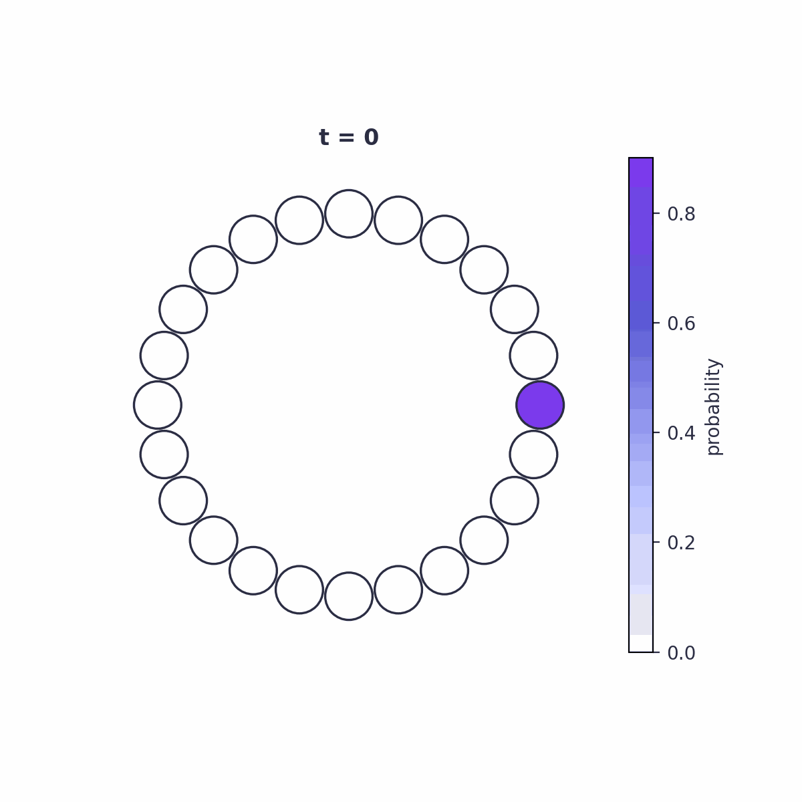
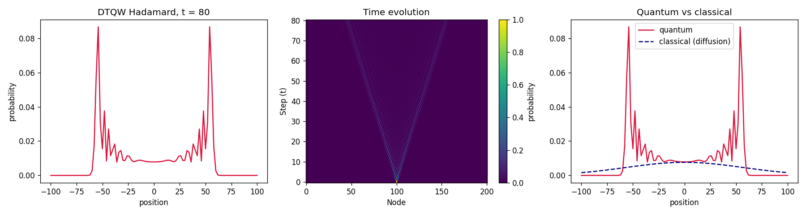
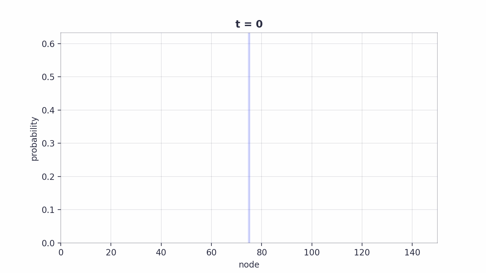
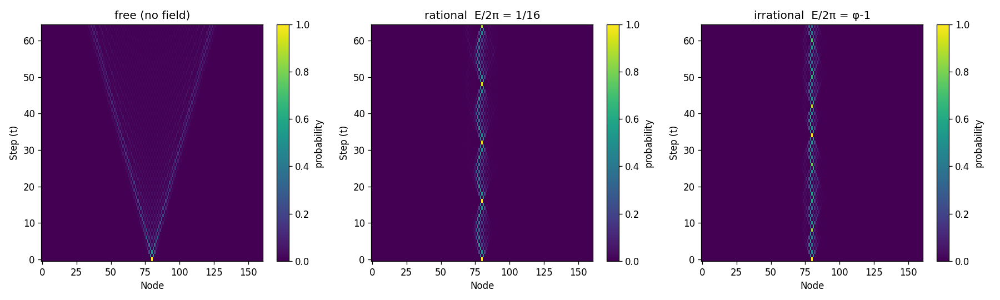
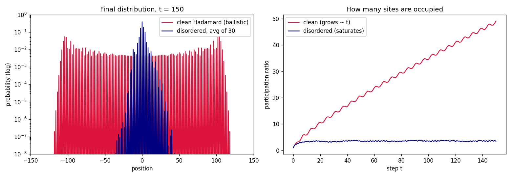
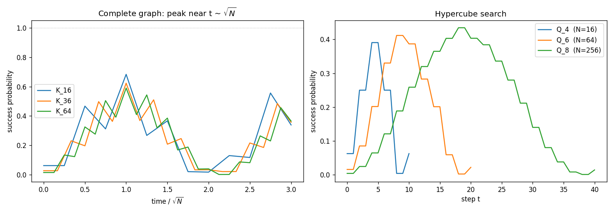

# ZitterWalk

<p align="center">
  
</p>

<p align="center">
  <em>A simple, dependency-light package to simulate <strong>Discrete-Time Quantum Walks (DTQW)</strong>,
  built for studying and experimenting.</em>
</p>

<p align="center">
  <a href="https://www.python.org/"></a>
  <a href="pyproject.toml"></a>
  <a href="#tests"></a>
</p>

The package is called **`zitterwalk`** — named after *Zitterbewegung* ("trembling
motion"), the jittery back-and-forth of a relativistic particle that DTQWs
reproduce at the discrete level. It only depends on `numpy` and `matplotlib`.

## Core idea

The state of a DTQW lives on the **arcs** (directed edges) of the graph. Each
edge `{u, v}` gives two arcs, `(u,v)` and `(v,u)`; an arc `(u,v)` means "the
walker is at `u` heading towards `v`". On that basis:

- **Coin `C`**: acts block-wise, one block per node. At a node of degree `d` it
  is a `d x d` unitary that shuffles the directions. This is *where* the coin
  enters.
- **Shift `S`**: a permutation of arcs — **flip-flop** `S|u→v> = |v→u>` (any
  graph, the default) or **moving** `S|x,±> = |x±1,±>` (the shift that makes the
  line walk a discretized Dirac equation). You can also supply your own.
- **One step**: `U = S · C` (shuffle and move), optionally with a per-step
  electric-field phase. It is unitary ⇒ conserves the norm.

This arc formulation generalizes to **any graph** (not just the line).

## Features

- **Graphs**: line, cycle, complete, grid, hypercube, or build your own
  (`add_edge`), including **self-loops** for lackadaisical walks.
- **Coins**: `grover`, `fourier`, `hadamard`, the tunable reflection `rotation(θ)`
  and the SU(2) `su2(θ)` (the Dirac "mass" coin) — used uniformly, **per node**
  (`{node: coin}`), as **static disorder** (`random_coins`), or **time-dependent**
  (`coin_schedule`).
- **Shifts & fields**: **flip-flop** or **moving** shift (or a custom arc
  permutation), plus a static **electric field** (per-step position-dependent
  phase) on the line.
- **Initial states**: localized (`at_node`), uniform, arbitrary
  (`superposition`), and wide **Gaussian** packets (`gaussian`, with tunable
  momentum) for the semiclassical / Dirac regime.
- **Observables**: mean position, variance/std, participation ratio,
  coin–position entanglement entropy, return probability, time-averaged
  limiting distribution, mixing time, the quasi-energy `spectrum()`, and
  trajectory curves `<x>(t)`, `σ(t)`, `p(t)`.
- **Measurement & search**: absorbing nodes and hitting times, position
  `measure()` with optional collapse, and `O(√N)` quantum spatial search
  (`DiscreteTimeWalk.search`).
- **Reproduces the literature**: Bloch oscillations, dynamical localization,
  zitterbewegung and Klein's paradox — see [below](#reproducing-the-literature).
- **Visualization**: distributions, node-link diagrams, heatmaps and GIFs.

👉 **Full tutorial: [`docs/guide.md`](docs/guide.md).**

## What it looks like

The canonical example — a Hadamard walk on a line — spreads **ballistically**
(`O(t)`) instead of diffusing like a classical random walk (`O(√t)`), giving
the characteristic "two-horn" distribution:

<p align="center">
  
</p>

An animated version of the same walk, with an adaptive y-axis so the spread
stays visible over time:

<p align="center">
  
</p>

Adding an electric field along the line reveals **Bloch oscillations** and
**dynamical localization**, depending on whether the field is a rational or
irrational multiple of `2π`:

<p align="center">
  
</p>

Give every site its **own random coin** (static disorder) and the ballistic
spreading collapses into exponential **Anderson localization** — the
participation ratio stops growing:

<p align="center">
  
</p>

The flagship application is **quantum spatial search**: a marked-coin walk
concentrates on the target vertex in `O(√t)`, so the success probability peaks
around `t ≈ √N` — the quadratic speedup over classical search:

<p align="center">
  
</p>

## Reproducing the literature

With the **moving shift**, the line walk is a discretization of the 1-D Dirac
equation, and `zitterwalk` reproduces the standard quantum-walk physics results
numerically. Each paper below has a runnable example:

| Paper | Effect | Example |
|-------|--------|---------|
| Kurzyński, *Phys. Lett. A* **372**, 6125 (2008) | **Zitterbewegung** — `<x>(t)` trembles at `ω = θ` (coin angle = mass) | `examples/zitterbewegung.py` |
| Kurzyński (2008) | **Klein's paradox** — re-entrant transmission into the antiparticle band at a high potential step | `examples/klein_paradox.py` |
| Arnault, Pepper & Pérez, *Phys. Rev. A* **101**, 062324 (2020) | **Bloch oscillations** — a wide packet oscillates with period `2π/φ` | `examples/dirac_bloch.py` |
| Cedzich et al., *Phys. Rev. Lett.* **111**, 160601 (2013) | **Revivals vs. localization** — rational field revives at `t=2m`; irrational field localizes | `examples/electric_revivals.py` |

The building blocks are `shift="moving"`, the `su2(θ)` coin, `Walker.gaussian`,
a `field=...` potential, and the `mean_position_evolution` /
`return_probability_evolution` trajectory observables. See
[§9 of the guide](docs/guide.md#9-electric-fields).

## Structure

| Module | Responsibility |
|--------|----------------|
| `graph.py`  | Topology: `Graph`, `Node`, `Edge`, the arc representation, node coordinates. |
| `coin.py`   | Coins: `hadamard`, `grover`, `fourier`, `rotation`, `su2` + per-node/disorder/marked assembly. |
| `walker.py` | `Walker`: the initial quantum state (`at_node`, `uniform`, `superposition`, `gaussian`). |
| `walk.py`   | `DiscreteTimeWalk`: evolution engine, observables, measurement, search. |
| `viz.py`    | Visualization (kept separate): distribution, graph, evolution, animations. |

The three responsibilities —**topology**, **state** and **dynamics**— are
separated on purpose.

## Install

```bash
pip install -e .
```

## Quick use

```python
from zitterwalk import Graph, Walker, DiscreteTimeWalk

g = Graph.line(201)                                 # line of 201 nodes
w = Walker.at_node(g, 100, coin_state=[1, 1j])      # symmetric start
walk = DiscreteTimeWalk(g, coin="hadamard")

final = walk.step(w, times=80)                      # 80 steps
p = walk.probabilities(final)                       # per-node distribution

walk.std(final)                                     # spread ~ t (ballistic)
walk.coin_entropy(final)                            # coin–position entanglement
```

Factory graphs: `Graph.line(n)`, `Graph.cycle(n)`, `Graph.complete(n)`,
`Graph.grid(rows, cols)`, `Graph.hypercube(dim)`. You can also build your own
with `add_edge` (and `add_self_loops` for lackadaisical walks).

Coins: `"grover"` (any degree, default), `"fourier"` (any degree), `"hadamard"`
(power-of-two degree), `rotation(θ)` and `su2(θ)` (tunable, degree 2). Or pass
your own callable / matrix, a `dict {node: coin}` for **inhomogeneous** coins,
`random_coins(g, seed=...)` for **disorder**, or `coin_schedule` for a
**time-dependent** coin. Pick the shift with `shift="flip_flop"` (default) or
`shift="moving"`.

A few things you can do beyond a plain walk:

```python
# Anderson localization: a random coin per site.
walk = DiscreteTimeWalk(g, coin=random_coins(g, seed=0))

# Quantum search: find a marked vertex in ~√N steps.
g = Graph.complete(64)
walk = DiscreteTimeWalk.search(g, marked=0)
start = Walker.uniform(g)
sp = [walk.success_probability(s) for s in walk.run(start, 25)]   # peaks at t≈8

# Hitting time: absorb the walker at a trap and watch it get caught.
walk = DiscreteTimeWalk(g_line, coin="hadamard", absorbing=60)

# Dirac walk: moving shift + su2 coin -> zitterbewegung of a wide packet.
from zitterwalk import su2
walk = DiscreteTimeWalk(g_line, coin=su2(np.pi/2), shift="moving")
w = Walker.gaussian(g_line, center=100, width=22, coin_state=[1, 0])
xt = walk.mean_position_evolution(walk.run(w, 80))   # <x>(t) trembles at ω≈θ
```

See [`docs/guide.md`](docs/guide.md) for the full API and worked examples.

## Examples

```bash
python examples/line_hadamard.py         # static "two-horn" distribution
python examples/line_animation.py        # animated curve + bars + shaded area (GIF)
python examples/cycle_animation.py       # same, on a small cycle (self-interference)
python examples/cycle_nodes_animation.py # nodes on a ring, colored by population
python examples/bloch_oscillations.py    # electric field: free vs Bloch vs localized (heatmap)
python examples/bloch_animation.py       # electric field: the walker "breathes" (GIF)
python examples/bloch_compare.py         # rational vs irrational field, side by side (GIF)
python examples/coin_dispersion.py       # rotation coin: tuning the spread velocity
python examples/anderson_localization.py # static disorder -> localization
python examples/quantum_search.py        # O(√N) search on K_n and the hypercube
python examples/hitting_time.py          # absorbing trap: survival + first-passage
# Reproducing the physics literature (moving shift = discretized Dirac equation):
python examples/zitterbewegung.py        # <x>(t) trembles at ω = θ  (Kurzyński 2008)
python examples/klein_paradox.py         # re-entrant transmission at a step (Kurzyński 2008)
python examples/dirac_bloch.py           # semiclassical Bloch oscillations (Arnault et al. 2020)
python examples/electric_revivals.py     # revivals vs localization (Cedzich et al. 2013)
```

`line_hadamard.py` reproduces the "two-horn" distribution of the Hadamard walk
and compares it with classical diffusion (the quantum one spreads as `O(t)`,
not `O(√t)`). The others save animated GIFs via `viz.animate`, which offers
three styles: `kind="line"` (curve + bars + fill, adaptive y-axis), `"bar"`,
and `"graph"` (nodes colored by probability).

## Tests

```bash
python tests/test_walk.py        # or: python -m pytest
```

They check coin unitarity, norm conservation, that probabilities sum to 1, the
characteristic ballistic spreading, and the newer features: `rotation(π/4) ==`
Hadamard, disorder-induced localization, time-dependent-coin unitarity,
observables against hand computations, self-loops, absorption, search beating
the uniform `1/N`, the configurable shifts (flip-flop / moving / custom), the
`su2` coin gap, Gaussian packets, and the Dirac physics (zitterbewegung
frequency `= θ`, electric-field localization).
