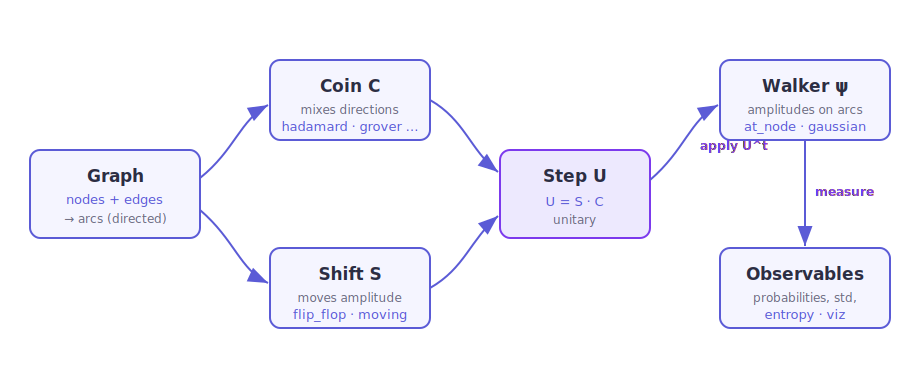

Tutorial
========

This tutorial walks through a full ZitterWalk session, from building a graph to
reading off physics and drawing pictures. Every ``>>>`` block below is executed
by ``make doctest``, so the outputs are real. If you have the package installed
you can paste the snippets straight into a Python prompt.

.. contents:: On this page
   :local:
   :depth: 1

The four building blocks
-------------------------

A simulation is assembled from four objects, which mirror the physics one to
one:

         the unitary step operator U, applied to a Walker state and read out
         through observables.
   :width: 100%

   The pipeline. The :class:`~zitterwalk.graph.Graph` provides the arcs; the
   coin ``C`` and shift ``S`` combine into the unitary step ``U = S · C``, which
   evolves the :class:`~zitterwalk.walker.Walker` state ``ψ``. Observables and
   :mod:`~zitterwalk.viz` read the state back out.

#. **Graph** — the topology. The quantum state lives on its *arcs* (directed
   edges), so an :math:`n`-node line has :math:`2(n-1)` of them.
#. **Coin** — a small unitary that mixes the outgoing directions at each node.
#. **Walker** — the quantum state: one complex amplitude per arc.
#. **DiscreteTimeWalk** — the engine that folds coin, shift (and optionally a
   field) into a single step operator and evolves the walker.

Step 1 — build a graph
-----------------------

Start from one of the built-in topologies. A line of 101 nodes:

.. doctest::

   >>> g = Graph.line(101)
   >>> g
   Graph(n_nodes=101, n_edges=100)
   >>> g.n_arcs                 # two directed arcs per edge
   200
   >>> g.neighbors(50)
   [49, 51]

The other constructors follow the same pattern —
:meth:`~zitterwalk.graph.Graph.cycle`,
:meth:`~zitterwalk.graph.Graph.complete`,
:meth:`~zitterwalk.graph.Graph.grid` and
:meth:`~zitterwalk.graph.Graph.hypercube`:

.. doctest::

   >>> Graph.cycle(8).degree(0)          # a ring: every node has degree 2
   2
   >>> Graph.grid(3, 3).degree((1, 1))   # interior grid node
   4
   >>> Graph.hypercube(3).n_nodes        # 2**dim nodes
   8

You can also build a graph by hand with
:meth:`~zitterwalk.graph.Graph.add_edge`, and attach custom coordinates with
:meth:`~zitterwalk.graph.Graph.set_coords` if the node ids are not already
numeric.

Step 2 — prepare a walker
-------------------------

The most common start is a single localized node. On a line, the *symmetric*
coin state ``[1, 1j]`` gives a distribution that spreads evenly to both sides:

.. doctest::

   >>> w = Walker.at_node(g, 50, coin_state=[1, 1j])
   >>> w
   Walker(n_arcs=200, norm=1.000000)
   >>> bool(abs(w.norm - 1.0) < 1e-12)   # states are normalized on creation
   True

Other initial states are just as easy —
:meth:`~zitterwalk.walker.Walker.uniform` (equal superposition over all arcs),
:meth:`~zitterwalk.walker.Walker.superposition` (from an explicit
``{arc: amplitude}`` dict), and :meth:`~zitterwalk.walker.Walker.gaussian` (a
wave packet with optional momentum, the natural choice for the Dirac-equation
experiments):

.. doctest::

   >>> packet = Walker.gaussian(g, center=50, width=8.0, coin_state=[1, -1])
   >>> bool(abs(packet.norm - 1.0) < 1e-12)
   True

Step 3 — evolve
---------------

Wrap the graph in a :class:`~zitterwalk.walk.DiscreteTimeWalk`, choose a coin,
and step. :meth:`~zitterwalk.walk.DiscreteTimeWalk.step` returns the evolved
state; :meth:`~zitterwalk.walk.DiscreteTimeWalk.run` returns the whole
trajectory (``steps + 1`` states, including the initial one):

.. doctest::

   >>> walk = DiscreteTimeWalk(g, coin="hadamard")
   >>> final = walk.step(w, times=40)
   >>> p = walk.probabilities(final)
   >>> float(round(p.sum(), 12))          # unitary: probability is conserved
   1.0
   >>> states = walk.run(w, 40)
   >>> len(states)
   41

The distribution is the classic "two-horn" shape, with the mass pushed out to
the ballistic fronts:

.. plot::
   :caption: The Hadamard walk after 40 steps and its time evolution
             (a light-cone of ballistic fronts).

   import numpy as np
   import matplotlib.pyplot as plt
   from zitterwalk import Graph, Walker, DiscreteTimeWalk, viz

   g = Graph.line(101)
   walk = DiscreteTimeWalk(g, coin="hadamard")
   w = Walker.at_node(g, 50, coin_state=[1, 1j])
   states = walk.run(w, 40)

   fig, (ax1, ax2) = plt.subplots(1, 2, figsize=(9, 3.4))
   p = walk.probabilities(states[-1])
   pos = np.arange(101) - 50
   mask = (np.arange(101) % 2) == 40 % 2
   ax1.plot(pos[mask], p[mask], color="#5b5bd6", lw=2)
   ax1.fill_between(pos[mask], p[mask], color="#5b5bd6", alpha=0.2)
   ax1.set_title("distribution, t = 40")
   ax1.set_xlabel("position"); ax1.set_ylabel("probability")

   viz.plot_evolution(walk, states, ax=ax2)

Step 4 — read off observables
------------------------------

The walk exposes the standard quantum-walk observables. The spreading is
*ballistic*, so the standard deviation grows linearly in time — quadruple the
steps and (away from the boundary) the spread roughly quadruples too:

.. doctest::

   >>> s20 = walk.std(walk.step(w, 20))
   >>> s80 = walk.std(walk.step(w, 80))
   >>> bool(s80 / s20 > 3.0)              # ~4 (ballistic), not ~2 (diffusive)
   True

Localization and spreading diagnostics come with the same one-call interface:

.. doctest::

   >>> pr = walk.participation_ratio(walk.step(w, 30))
   >>> bool(pr > 10)                      # spread over many nodes
   True

The coin–position entanglement entropy starts at zero for a definite coin state
and settles into ``[0, 1]`` bit as the walk mixes the coin:

.. doctest::

   >>> cyc = Graph.cycle(64)
   >>> cwalk = DiscreteTimeWalk(cyc, coin="hadamard")
   >>> c0 = Walker.at_node(cyc, 0, coin_state=[1, 0])
   >>> bool(abs(cwalk.coin_entropy(c0)) < 1e-9)     # definite coin: zero entropy
   True
   >>> e = cwalk.coin_entropy(cwalk.step(c0, 20))
   >>> bool(0.0 <= e <= 1.0 + 1e-9)
   True

Every scalar observable has an ``..._evolution`` sibling that maps it over a
whole trajectory, which is exactly what you feed to a plot:

.. plot::
   :caption: Linear growth of the standard deviation — the ballistic
             signature of a quantum walk, next to the diffusive
             :math:`\sqrt{t}` of a classical one.

   import numpy as np
   import matplotlib.pyplot as plt
   from zitterwalk import Graph, Walker, DiscreteTimeWalk

   g = Graph.line(241)
   walk = DiscreteTimeWalk(g, coin="hadamard")
   w = Walker.at_node(g, 120, coin_state=[1, 1j])
   states = walk.run(w, 100)
   sigma = walk.std_evolution(states)

   t = np.arange(len(sigma))
   fig, ax = plt.subplots(figsize=(6.5, 3.4))
   ax.plot(t, sigma, color="#5b5bd6", lw=2, label=r"quantum  $\sim t$")
   ax.plot(t, np.sqrt(t) * sigma[-1] / np.sqrt(t[-1]), color="#b8c0ff",
           ls="--", lw=2, label=r"classical  $\sim \sqrt{t}$")
   ax.set_xlabel("step  t"); ax.set_ylabel(r"$\sigma(t)$")
   ax.legend()

Choosing a coin
---------------

The coin is the physics knob. Besides the named coins (``"hadamard"``,
``"grover"``, ``"fourier"``) you can pass the tunable
:func:`~zitterwalk.coin.rotation` and :func:`~zitterwalk.coin.su2` factories, a
fixed matrix, or a ``{node: coin}`` dict for an inhomogeneous walk. The rotation
coin ``C(θ)`` sets the group velocity of the fronts to ``cos θ``:

.. doctest::

   >>> import numpy as np
   >>> a = DiscreteTimeWalk(g, coin="hadamard").step(w, 30)
   >>> b = DiscreteTimeWalk(g, coin=rotation(np.pi / 4)).step(w, 30)
   >>> bool(np.allclose(a.psi, b.psi))    # rotation(pi/4) *is* the Hadamard coin
   True

.. plot::
   :caption: Tuning the rotation coin. Smaller :math:`\theta` sends the walker
             out faster (peaks at :math:`\pm\cos\theta\,t`); larger
             :math:`\theta` freezes it near the origin.

   import numpy as np
   import matplotlib.pyplot as plt
   from zitterwalk import Graph, Walker, DiscreteTimeWalk, rotation

   n, center, steps = 301, 150, 100
   g = Graph.line(n)
   w = Walker.at_node(g, center, coin_state=[1, 1j])
   pos = np.arange(n) - center
   mask = (np.arange(n) % 2) == (center + steps) % 2

   fig, ax = plt.subplots(figsize=(7, 3.6))
   for theta, color in zip([0.15, 0.25, 0.35, 0.45],
                           ["#7c3aed", "#5b5bd6", "#8b93f0", "#b8c0ff"]):
       walk = DiscreteTimeWalk(g, coin=rotation(theta * np.pi))
       p = walk.probabilities(walk.step(w, steps))
       ax.plot(pos[mask], p[mask], color=color,
               label=fr"$\theta={theta:.2f}\pi$")
   ax.set_xlabel("position"); ax.set_ylabel("probability")
   ax.set_title(r"rotation coin $C(\theta)$, t = 100")
   ax.legend()

Disorder and localization
--------------------------

Give every node its own random coin and the ballistic transport collapses into
**Anderson localization** — the walker stays pinned near the origin instead of
spreading:

.. doctest::

   >>> g = Graph.line(201)
   >>> w = Walker.at_node(g, 100, coin_state=[1, 1j])
   >>> clean = DiscreteTimeWalk(g, coin="hadamard")
   >>> dirty = DiscreteTimeWalk(g, coin=random_coins(g, seed=0))
   >>> s_clean = clean.std(clean.step(w, 120))
   >>> s_dirty = dirty.std(dirty.step(w, 120))
   >>> bool(s_dirty < 0.4 * s_clean)     # disorder localizes
   True

Quantum search
--------------

On a complete graph, :meth:`~zitterwalk.walk.DiscreteTimeWalk.search` builds a
walk that concentrates amplitude on a marked vertex, lifting its probability far
above the uniform ``1/N``:

.. doctest::

   >>> gc = Graph.complete(32)
   >>> search = DiscreteTimeWalk.search(gc, marked=7)
   >>> u = Walker.uniform(gc)
   >>> peak = max(search.success_probability(s) for s in search.run(u, 25))
   >>> bool(peak > 0.4)                   # vs 1/32 ~ 0.03 for a random guess
   True

You can also *measure* the walker, sampling a node from its distribution (with
an optional collapse of the state). Passing a ``seed`` makes it reproducible:

.. doctest::

   >>> line = Graph.line(21)
   >>> lwalk = DiscreteTimeWalk(line, coin="hadamard")
   >>> lw = Walker.at_node(line, 10, coin_state=[1, 1j])
   >>> node, collapsed = lwalk.measure(lwalk.step(lw, 8), seed=0, collapse=True)
   >>> float(round(lwalk.probabilities(collapsed)[line.node_position(node)], 12))
   1.0

Visualizing on the graph
------------------------

For non-line topologies, :func:`~zitterwalk.viz.plot_graph` draws the walk as a
node-link diagram colored by probability. Here is a walk on a cycle, part-way
through mixing:

.. plot::
   :caption: A Grover walk on a 24-node ring, nodes colored by population.

   from zitterwalk import Graph, Walker, DiscreteTimeWalk, viz

   g = Graph.cycle(24)
   walk = DiscreteTimeWalk(g, coin="grover")
   w = Walker.at_node(g, 0)
   p = walk.probabilities(walk.step(w, 6))
   viz.plot_graph(g, p, kind="circular", node_size=260)

For time-resolved output, :func:`~zitterwalk.viz.animate` produces a
matplotlib animation (savable as a GIF) in ``"line"``, ``"bar"`` or ``"graph"``
style — see the module reference for the full signature.

Where to next
-------------

* :doc:`theory` — the math behind the step operator and the phenomena above.
* :doc:`api/zitterwalk` — the complete API reference, generated from the
  docstrings.
